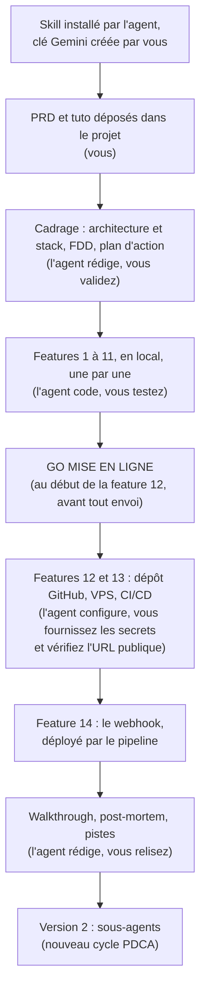

# Apprendre à créer et héberger des agents autonomes en Python

> **Ceci est un projet pédagogique.** Son but n'est pas de livrer une application, mais de vous apprendre à **concevoir, coder et mettre en production un agent IA autonome écrit en Python**, pas à pas, en vibe coding.
> Par **Le Cinquième Jour** · Version 1.0 · septembre 2026

## 🎯 Un projet pour apprendre

À la fin de ce parcours, vous saurez :

- **créer** un agent autonome en Python : un programme qui raisonne avec un modèle d'IA, appelle des outils, garde une mémoire et se déclenche tout seul (cron, webhook) ;
- **l'observer** : voir ce qu'il fait, ce qu'il sait et ce qu'il coûte ;
- **l'héberger** : le déployer sur votre propre serveur (VPS), en HTTPS, mis à jour automatiquement à chaque modification.

Pour apprendre tout cela sur du concret, vous construisez un agent complet : **GoodVibe**. Ce n'est qu'un prétexte, un fil rouge. Ce qui compte, ce sont les briques que vous apprenez à assembler, réutilisables pour n'importe quel autre agent.

## 🧭 Le moteur du tuto : le skill VibeCoding Copilote

Ce tuto est l'application pratique du skill **[VibeCoding Copilote](https://github.com/lecinquiemejour-code/vibecoding-copilote)** (Le Cinquième Jour). **Il est indispensable : sans lui, le tuto ne fonctionne pas.**

| | Rôle |
|---|---|
| [**vibecoding-copilote**](https://github.com/lecinquiemejour-code/vibecoding-copilote) | **La méthode.** Un skill qui pilote votre agent de codage à partir d'un PRD : cadrage (architecture, découpage, plan d'action), puis construction feature par feature avec une **validation humaine à chaque étape** (les « GO »), jusqu'à la mise en ligne. Réutilisable pour n'importe quel projet. |
| **goodvibe-tuto** (ce dépôt) | **Le cas pratique.** Le PRD de GoodVibe et le tuto qui indique au skill, pour chaque feature, les options à proposer, les points à relire et les tests à faire. |

👉 Vous n'avez rien à télécharger à la main : **c'est l'agent qui installe le skill** à l'étape 3 du démarrage rapide.

---

## C'est quoi GoodVibe ?

**GoodVibe** est un assistant personnel du matin. Il :

- apprend qui vous êtes en discutant avec vous (prénom, signe astrologique, ville, centres d'intérêt) ;
- prépare chaque matin à 7 h un **brief personnalisé** : horoscope réécrit pour vous, météo de votre ville, image du jour, pense-bêtes ;
- répond à vos questions dans la journée, depuis votre **terminal** ou une **page web privée** ;
- montre tout ce qu'il sait de vous et tout ce qu'il fait (outils appelés, tokens consommés, coût estimé).

Le sujet est volontairement léger. L'architecture, elle, est celle d'un vrai agent en production : remplacez horoscope et météo par veille concurrentielle et boîte mail, rien ne change.

## Ce que vous allez apprendre

| Brique | Dans GoodVibe |
|---|---|
| Boucle d'agent | Le chat en streaming, avec appels d'outils |
| Prompt système et réglages | La fiche de poste de GoodVibe, dans un fichier Markdown, et le tempérament du modèle : température, longueur de réponse, réflexion |
| Cron | Le brief généré chaque matin à 7 h sur le serveur, une seule fois par jour |
| Webhook | Un pense-bête envoyé depuis votre téléphone via un client HTTP en ligne (Hoppscotch), protégé par un jeton secret |
| Outil sur mesure | La météo, lue dans l'API Open-Meteo par un appel direct : la description de l'outil, la requête et la mise en forme sont écrites par nous |
| MCP | L'horoscope, lu dans une autre API par le serveur MCP officiel `fetch` : cette fois l'outil est apporté par le serveur, un petit programme que GoodVibe lance sur sa propre machine. Deux chemins vers deux API, à comparer |
| Pannes visibles | Quand une source ne répond pas, le brief sort avec un message d'erreur à sa place, qui dit ce qui a échoué et pourquoi. Aucun contenu de remplacement, rien d'inventé |
| Mémoire | Le profil, les notes et les conversations en SQLite, avec le retrait d'une note et « Oublie-moi ». Les conversations ne gardent que le dialogue : vos messages et le texte des réponses |
| Observabilité | Un journal d'activité : tokens, latence, coût en euros. Et les coulisses, en direct : la réflexion du modèle, puis chaque appel d'outil avec ses JSON, dans le chat comme dans le brief, et un relevé des tokens sous chaque réponse. Coulisses et relevé s'affichent à l'écran, sans être enregistrés ni renvoyés au modèle |
| CI/CD | Déploiement automatique par GitHub Actions à chaque push |
| Production | Un VPS Ubuntu, `systemd`, Caddy en HTTPS |
| Sous-agents | La version 2 : horoscope et météo délégués à des agents spécialisés |

## Contenu de ce dépôt

Ce dépôt ne contient **pas de code** : c'est le kit de départ. Le code, c'est vous (et votre agent) qui allez le produire.

| Fichier | Rôle |
|---|---|
| [`GoodVibe-PRD.md`](GoodVibe-PRD.md) | Le cahier des charges produit : **quoi** construire (fonctionnalités, contraintes, critères de succès). Fourni prêt à l'emploi. |
| [`tuto-goodvibe-vibecoding.md`](tuto-goodvibe-vibecoding.md) | Le tuto : **comment** le construire. Sert de référence à l'agent de codage : options de chaque étape, points à relire, tests à faire. |
| `README.md` | Ce fichier : la présentation du projet. Dans votre dossier de travail, l'agent le renomme en `GoodVibe-presentation.md` et s'en sert pour vous présenter le projet avant de commencer. |

## Pour qui ?

Pour les **développeurs intermédiaires** qui découvrent les agents et le vibe coding. « Intermédiaire » signifie ici savoir **lire** le code généré pour le juger, pas forcément l'écrire.

Le principe : **l'agent de codage fait, vous pilotez.** L'agent écrit le code, installe les outils, lance les commandes et gère Git, en expliquant ce qu'il fait. Vous :

- créez les comptes en ligne et copiez les clés API ;
- validez chaque étape (les « GO ») ;
- testez le résultat (le CHECK) : c'est vous qui jugez, jamais l'agent.

## Prérequis

- Un éditeur avec un agent de codage : **Antigravity IDE** et son agent Gemini intégré, ou **VS Code** avec Claude Code, Codex ou GitHub Copilot. Le parcours a été rodé avec Antigravity ; le prompt de démarrage et les fichiers de règles sont prévus pour les quatre agents.
- Un compte **Google AI Studio**. La clé API Gemini se crée plus tard, à la fiche 1 : inutile de l'anticiper.
- Un compte **GitHub**.
- *Pour la mise en ligne uniquement (fin de parcours)* : un compte **Hetzner Cloud** (ou tout VPS Ubuntu accessible en SSH). Un nom de domaine est facultatif : le tuto utilise une adresse gratuite.
- *Recommandé* : l'extension **Claude Code** dans Antigravity, si vous avez un abonnement Claude. Elle prend le relais quand les quotas gratuits de Gemini sont atteints.

Pas besoin d'installer Python ni Git vous-même : **l'agent les installe** s'ils manquent.

## Ce qui est gratuit, ce qui coûte

- **Gratuit** : Antigravity, la clé Gemini en plan gratuit (avec des quotas : c'est pour cela que Claude Code est recommandé en relais), Open-Meteo et l'API horoscope (sans clé), GitHub et son pipeline GitHub Actions (le quota gratuit suffit largement).
- **Payant, à partir de la fiche 12 seulement** : le VPS, facturé à l'heure chez Hetzner, avec un plafond de quelques euros par mois. Attention : un serveur éteint reste facturé, il faut le supprimer pour arrêter les frais. Aucun nom de domaine à acheter : le tuto utilise une adresse gratuite. Jusque-là, tout tourne sur votre machine sans dépenser un centime.
- **À surveiller** : la génération d'images (fiche 10) dépend du quota de votre plan Google AI ; si le quota est atteint, le brief sort sans image, avec un message d'erreur qui le dit.

---

## 🚀 Démarrage rapide

### 1. Préparez un répertoire vierge

Créez un dossier vide (par exemple `goodvibe/`) et ouvrez-le avec votre éditeur : **Antigravity IDE** ou **VS Code**. Vous n'y mettrez qu'un seul fichier : le ZIP du kit.

### 2. Déposez le ZIP du kit dans le dossier

Ce dépôt est privé : vous avez reçu une **invitation GitHub par mail**. Acceptez-la, connectez-vous à GitHub, puis sur la page d'accueil du dépôt cliquez sur le bouton vert **`<> Code`** → **Download ZIP**. Déposez ce fichier ZIP tel quel dans votre dossier vierge, sans l'ouvrir : c'est l'agent qui le décompressera. Il contient :

- `GoodVibe-PRD.md`
- `tuto-goodvibe-vibecoding.md`
- `README.md` : la présentation du projet, que l'agent renommera en `GoodVibe-presentation.md`

> ⚠️ Rien d'autre : pas de venv, pas de Git, pas de skill. Ne clonez pas ce dépôt dans votre dossier de travail : l'agent initialisera lui-même **votre** dépôt Git. L'agent s'occupe du reste.

> 💡 Les schémas du tuto sont en Mermaid : ils s'affichent sur GitHub, mais pas dans l'aperçu Markdown d'Antigravity sans extension. Installez **Markdown Preview Mermaid Support** : Ctrl + Maj + X, tapez `bierner.markdown-mermaid` (la marketplace d'Antigravity est Open VSX, la recherche en clair la classe mal), puis Ctrl + Maj + V pour l'aperçu. Ou lisez le tuto **sur GitHub**.

### 3. Collez ce prompt dans votre agent

Complétez d'abord la ligne « Profil de calibrage », à la fin du prompt : c'est elle qui règle le niveau des explications. Si vous débutez, écrivez « (1) je débute » : l'agent expliquera chaque mot technique.

```
Nous démarrons le projet GoodVibe dans ce répertoire vierge. Si une étape ci-dessous est déjà faite, dis-le-moi et passe à la suivante.

Étape 1, avant toute autre chose : décompresse le fichier .zip du kit présent dans ce dossier (celui qui contient GoodVibe-PRD.md), place ses trois fichiers (GoodVibe-PRD.md, tuto-goodvibe-vibecoding.md, README.md) à la racine, puis supprime le .zip et le dossier vide issu de la décompression. Renomme README.md en GoodVibe-presentation.md (c'est la présentation du projet : tu t'en serviras pour la visite guidée, ne la modifie pas).

Étape 2 : installe le skill VibeCoding Copilote dans .agents/skills/vibecoding-copilote/, dans ce seul dossier. Télécharge le ZIP du dépôt https://github.com/lecinquiemejour-code/vibecoding-copilote et extrais-le là, sans dossier .git. Si un ZIP du skill est déjà présent à la racine du projet, extrais celui-là au lieu de télécharger, puis supprime-le. Vérifie que SKILL.md, references/ et assets/CLAUDE.md sont présents, et dis-moi ce que tu as installé, et où.

Étape 3 : lis le SKILL.md du skill et déroule-le fidèlement sur GoodVibe-PRD.md, en commençant par la Phase 0.

Contexte du projet :
- Le skill VibeCoding Copilote donne la méthode : suis-le (présentation, question de calibrage, cadrage document par document, puis boucle PDCA feature par feature avec GO #1, CHECK par moi, GO #2), sauf sur les sept règles de la note d'en-tête du tuto, qui priment sur lui.
- Fichier de règles : quand le skill dépose son gabarit CLAUDE.md à la racine, ajoute-y les sept lignes de la section 3.4 du tuto, corrige les lignes du gabarit qu'elles contredisent, et montre-moi le fichier entier. Dépose-en une copie identique sous le nom AGENTS.md, et garde les deux fichiers identiques à chaque modification : selon l'agent, c'est l'un ou l'autre qui est lu.
- Document de reprise : tiens REPRISE.md à jour, comme l'indique la section 4.2 du tuto.
- Le fichier tuto-goodvibe-vibecoding.md est la référence du projet : lis sa note d'en-tête et applique-la. Avant tout document, présente-moi le projet : ce qu'on construit, ce qu'est un agent, ses capacités, la vue d'architecture. Explique chaque mot technique. Au PLAN, commence par la leçon (le problème, l'idée en langage courant, les mots nouveaux), puis dis-moi ce que tu vas faire, étape par étape, et pourquoi. Ne me propose pas trois options : présente-moi uniquement la solution du tuto, expliquée. Après le DO et avant le CHECK, montre-moi le schéma de séquence de la feature, puis les extraits de code qui comptent, et explique-les. N'affiche jamais un secret dans la discussion : ni clé, ni mot de passe, ni jeton. Au CHECK, fais une seule action à la fois et arrête-toi pour que je constate. Dis-moi toujours quand quelque chose échoue, et pourquoi. Les points « À relire » et le CHECK de chaque feature se conforment au tuto. Ne me dévoile pas les « pièges » avant mon verdict.
- Mise en ligne sur VPS via GitHub Actions, pas Netlify. Modèle de l'agent construit : Gemini via google-genai (API Interactions). Ne choisis aucun modèle au cadrage et n'en reprends aucun de mémoire : tu me recommanderas le modèle texte au PLAN de la fiche 1 et le modèle image au PLAN de la fiche 10, après recherche dans la documentation officielle de Google, comme l'indique la note d'en-tête du tuto.
- Tout ce que tu peux installer, tu l'installes toi-même (Python 3.12, Git, outils en ligne de commande, DB Browser). Tu exécutes toi-même toutes les commandes (venv, pip, git, lancement des serveurs) en expliquant ce que tu fais et pourquoi. Je ne fais que ce que tu ne peux pas faire : comptes, clés, validations, tests.
- Profil de calibrage : [écrivez ici « (1) je débute » ou « (2) je code déjà, je découvre le vibe coding »]. Inscris ce profil dans le fichier de règles du projet, et calibre toutes tes explications dessus.

Commence par l'étape 1.
```

> 💡 **Un autre agent, ou un autre éditeur ?** Le même prompt vaut pour tous : il fait lire le `SKILL.md` à l'agent, sans attendre que l'éditeur détecte le skill. Ensuite, chaque agent retrouve le skill et les règles par ses propres moyens :
>
> | Agent | Où il tourne | Comment il retrouve le skill | Le fichier de règles qu'il lit |
> |---|---|---|---|
> | Agent Gemini | Antigravity | Il détecte `.agents/skills/` | `AGENTS.md` |
> | Codex | VS Code, terminal | Il détecte `.agents/skills/` | `AGENTS.md` |
> | GitHub Copilot | VS Code | Il détecte `.agents/skills/` | `AGENTS.md` |
> | Claude Code | VS Code, Antigravity, terminal | Son fichier de règles lui dit où est le skill et de le lire | `CLAUDE.md` |
>
> C'est pour cela que le prompt demande deux fichiers de règles identiques, `CLAUDE.md` et `AGENTS.md`, et un seul dossier pour le skill. Vous pouvez changer d'agent en cours de projet : le prompt de reprise suffit.

### 4. Vérifiez que l'agent suit le skill

L'agent doit **se présenter**, résumer la méthode PDCA en une phrase et poser **une seule question** de calibrage. S'il écrit du code d'emblée ou saute la présentation, il ne suit pas le skill : passez à l'étape 5.

### 5. Si l'agent ne suit pas le skill

1. Vérifiez que le dossier `.agents/skills/vibecoding-copilote/` existe dans votre projet et contient `SKILL.md`.
2. S'il manque, l'agent n'a pas pu télécharger le skill. Faites-le vous-même : sur [la page du skill](https://github.com/lecinquiemejour-code/vibecoding-copilote), bouton vert **`<> Code`** → **Download ZIP**, puis déposez ce ZIP tel quel à la racine de votre projet, sans l'ouvrir.
3. Ouvrez une **nouvelle conversation** avec l'agent : c'est cela, « redémarrer la session ». L'agent relit alors ses fichiers de règles et la liste des skills.
4. Recollez le prompt de l'étape 3, en entier. L'agent constate ce qui est déjà fait et reprend à la bonne étape.

### Pour les sessions suivantes

**À la fin de chaque session**, dites à l'agent : « on s'arrête là ». Il met à jour `REPRISE.md`, le document de reprise du projet : où vous en êtes, ce qui attend votre décision, et le prompt à coller la prochaine fois.

**Au début de la session suivante**, ouvrez une nouvelle conversation et collez le prompt qui figure à la fin de `REPRISE.md`. S'il n'existe pas encore, collez celui-ci :

```
Reprends le vibecoding sur GoodVibe. Ce projet est déjà en cours et suit la méthode VibeCoding PDCA. Avant de me répondre, lis le SKILL.md du skill VibeCoding Copilote (dossier .agents/skills/vibecoding-copilote/), en particulier sa section « Reprise de session », puis la note d'en-tête de tuto-goodvibe-vibecoding.md, REPRISE.md et plan-action.md. Dis-moi où nous en sommes et ce que tu proposes de faire ensuite, puis attends ma réponse. Ne modifie aucun fichier sans mon GO.
```

## Si ça coince

| Symptôme | Que faire |
|---|---|
| L'agent écrit du code d'emblée, sans se présenter ni poser la question de calibrage | Il ne suit pas le skill : suivez l'étape 5 du démarrage rapide (dossier du skill, nouvelle conversation, prompt recollé). |
| L'agent n'arrive pas à télécharger le skill | Téléchargez vous-même son ZIP et déposez-le à la racine du projet : étape 5 du démarrage rapide. |
| L'agent code ou modifie des fichiers sans attendre votre GO | Rappelez-lui la **Règle 0** du fichier de règles (`CLAUDE.md` et sa copie `AGENTS.md`) : jamais de code sans GO. S'il récidive, ouvrez une nouvelle conversation : le fichier de règles est relu. Vérifiez que `AGENTS.md` existe : c'est lui que lisent l'agent Gemini d'Antigravity, Codex et GitHub Copilot. |
| « Quota exceeded », réponses qui s'arrêtent : le plan gratuit Gemini est épuisé | Attendez le renouvellement, ou passez le relais à **Claude Code** avec le prompt de reprise. |
| Vous reprenez après plusieurs jours sans savoir où vous en êtes | Ouvrez `REPRISE.md` dans votre projet : il dit où vous vous êtes arrêté et ce qui attend votre décision. `plan-action.md` dit quelle feature est « fait » et laquelle est en cours. Puis collez le prompt de reprise. |
| Erreur 404 ou « model not found » à l'appel de Gemini | Google a retiré ou renommé le modèle. Demandez à l'agent de vérifier la documentation officielle et de changer le nom dans `config.py`. |
| Un CHECK est KO et l'agent n'arrive pas à réparer | Chaque fiche du tuto a une rubrique **Pièges** : donnez-la à lire à l'agent, elle liste les causes classiques. |
| Sur GitHub, les schémas affichent « Unable to render rich display » | Ce n'est pas le tuto : une extension du navigateur empêche GitHub de dessiner les schémas. Ouvrez la page en navigation privée, ou désactivez les extensions une par une pour trouver la fautive. |

---

## Le parcours



Chaque feature suit la même boucle **PDCA** : l'agent vous fait la leçon (le problème, l'idée, les mots nouveaux), puis présente son **PLAN** (ce qu'il va faire, et pourquoi) → vous donnez le **GO #1** → l'agent **code**, puis vous montre et vous explique les extraits qui comptent → vous faites le **CHECK** → **GO #2** → commit.

Tout tourne **en local jusqu'à la feature 11 incluse** : vous avez un produit complet sur votre machine avant de dépenser un centime d'hébergement. Les deux déclencheurs autonomes, le cron et le webhook, n'arrivent qu'avec le serveur : c'est là qu'ils ont un sens.

**Les 14 fiches de la version 1** (détaillées dans le tuto, section 5) :

1. Squelette et chat terminal
2. Page web
3. Journal d'activité
4. Base et profil
5. Oublier, une note ou tout
6. Brief du matin
7. Météo
8. Horoscope via MCP
9. Onglets Mémoire et Activité
10. Image du jour
11. Tests automatisés
12. GO MISE EN LIGNE : dépôt GitHub privé, installation du VPS, cron du matin
13. CI/CD GitHub Actions
14. Webhook pense-bête, déployé par le pipeline

## Stack technique

Imposée par le PRD. C'est l'agent qui l'installe.

- **Langage** : Python 3.12
- **IA** : SDK `google-genai` (API Interactions). Les modèles ne sont pas imposés : au moment où une feature en a besoin (fiche 1 pour le texte, fiche 10 pour l'image), l'agent recherche dans la [documentation de Google](https://ai.google.dev/gemini-api/docs/models) ceux qui sont recommandés ce jour-là (le Gemini Flash stable le plus récent pour le texte, le modèle image stable le moins coûteux) et vous recommande un modèle, en l'expliquant. Vous validez.
- **Web** : FastAPI + uvicorn (webhook), Gradio (page web)
- **Données** : SQLite
- **Outils** : `httpx` (appels directs aux API), bibliothèque `mcp` (client MCP), serveur `mcp-server-fetch` lancé par `uvx` (serveur MCP), `logging`
- **Sources externes**, deux API sans clé : [Open-Meteo](https://open-meteo.com) (météo, appelée directement), [freehoroscopeapi.com](https://freehoroscopeapi.com) (horoscope, lu via le serveur MCP `fetch`)
- **Production** : VPS Ubuntu LTS, `systemd`, Caddy (HTTPS), GitHub Actions

## Règles d'or

- **Aucun secret dans le code** : les clés et mots de passe vont dans le fichier `.env`, qui n'est jamais commité.
- **Aucune donnée personnelle** dans les logs, les tests ou le dépôt Git. Utilisez un **profil fictif** pour la démo : le tuto prend Marc, né le 12 mars 1988, habitant Lyon, amateur de vélo. Reprenez-le tel quel.
- **C'est vous qui jugez** chaque étape. Ne donnez jamais un GO sans avoir testé.

## Liens

- Skill **VibeCoding Copilote** : https://github.com/lecinquiemejour-code/vibecoding-copilote
- Le tuto complet : [`tuto-goodvibe-vibecoding.md`](tuto-goodvibe-vibecoding.md)
- Le PRD : [`GoodVibe-PRD.md`](GoodVibe-PRD.md)

---

*Un tuto **Le Cinquième Jour**.*
