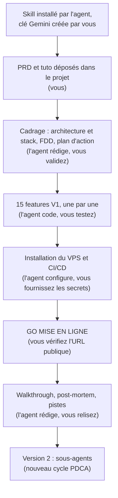

# Apprendre à créer et héberger des agents autonomes en Python

> **Ceci est un projet pédagogique.** Son but n'est pas de livrer une application, mais de vous apprendre à **concevoir, coder et mettre en production un agent IA autonome écrit en Python**, pas à pas, en vibe coding.
> Par **Le Cinquième Jour** · Version 1.0 · septembre 2026

## 🎯 Un projet pour apprendre

À la fin de ce parcours, vous saurez :

- **créer** un agent autonome en Python : un programme qui raisonne avec un modèle d'IA, appelle des outils, garde une mémoire et se déclenche tout seul (cron, webhook) ;
- **l'observer** : voir ce qu'il fait, ce qu'il sait et ce qu'il coûte ;
- **l'héberger** : le déployer sur votre propre serveur (VPS), en HTTPS, mis à jour automatiquement à chaque modification.

Pour apprendre tout cela sur du concret, vous construisez un agent complet : **GoodVibe**. Ce n'est qu'un prétexte, un fil rouge. Ce qui compte, ce sont les briques que vous apprenez à assembler, réutilisables pour n'importe quel autre agent.

---

## C'est quoi GoodVibe ?

**GoodVibe** est un assistant personnel du matin. Il :

- apprend qui vous êtes en discutant avec vous (prénom, signe astrologique, ville, centres d'intérêt) ;
- prépare chaque matin à 7 h un **brief personnalisé** : horoscope réécrit pour vous, météo de votre ville, image du jour, pense-bêtes ;
- répond à vos questions dans la journée, depuis votre **terminal** ou une **page web privée** ;
- montre tout ce qu'il sait de vous et tout ce qu'il fait (outils appelés, tokens consommés, coût estimé).

Le sujet est volontairement léger. L'architecture, elle, est celle d'un vrai agent en production : remplacez horoscope et météo par veille concurrentielle et boîte mail, rien ne change.

## Ce que vous allez apprendre

| Brique | Dans GoodVibe |
|---|---|
| Boucle d'agent | Le chat en streaming, avec appels d'outils |
| Cron | Le brief généré chaque matin à 7 h, une seule fois par jour |
| Webhook | Un pense-bête envoyé depuis votre téléphone, protégé par un jeton secret |
| MCP | L'horoscope récupéré via le serveur MCP officiel `fetch` |
| Mémoire | Le profil, les notes et les conversations en SQLite, avec « Oublie-moi » |
| Observabilité | Un journal d'activité : tokens, latence, coût en euros |
| CI/CD | Déploiement automatique par GitHub Actions à chaque push |
| Production | Un VPS Ubuntu, `systemd`, Caddy en HTTPS |
| Sous-agents | La version 2 : horoscope et météo délégués à des agents spécialisés |

## Contenu de ce dépôt

Ce dépôt ne contient **pas de code** : c'est le kit de départ. Le code, c'est vous (et votre agent) qui allez le produire.

| Fichier | Rôle |
|---|---|
| [`GoodVibe-PRD.md`](GoodVibe-PRD.md) | Le cahier des charges produit : **quoi** construire (fonctionnalités, contraintes, critères de succès). Fourni prêt à l'emploi. |
| [`tuto-goodvibe-vibecoding.md`](tuto-goodvibe-vibecoding.md) | Le tuto : **comment** le construire. Sert de référence à l'agent de codage : options de chaque étape, points à relire, tests à faire. |
| `README.md` | Ce fichier. |

## Pour qui ?

Pour les **développeurs intermédiaires** qui découvrent les agents et le vibe coding. « Intermédiaire » signifie ici savoir **lire** le code généré pour le juger, pas forcément l'écrire.

Le principe : **l'agent de codage fait, vous pilotez.** L'agent écrit le code, installe les outils, lance les commandes et gère Git, en expliquant ce qu'il fait. Vous :

- créez les comptes en ligne et copiez les clés API ;
- validez chaque étape (les « GO ») ;
- testez le résultat (le CHECK) : c'est vous qui jugez, jamais l'agent.

## Prérequis

- **Antigravity IDE** installé, avec Gemini intégré.
- Un compte **Google AI Studio**. La clé API Gemini se crée plus tard, à la fiche 1 : inutile de l'anticiper.
- Un compte **GitHub**.
- *Pour la mise en ligne uniquement (fin de parcours)* : un compte **Hetzner Cloud** (ou tout VPS Ubuntu accessible en SSH) et un nom de domaine ou sous-domaine.
- *Recommandé* : l'extension **Claude Code** dans Antigravity, si vous avez un abonnement Claude. Elle prend le relais quand les quotas gratuits de Gemini sont atteints.

Pas besoin d'installer Python ni Git vous-même : **l'agent les installe** s'ils manquent.

---

## 🚀 Démarrage rapide

### 1. Préparez un répertoire vierge

Créez un dossier vide (par exemple `goodvibe/`) et ouvrez-le avec **Antigravity IDE**.

### 2. Déposez les deux fichiers du tuto

Copiez dans ce dossier **uniquement** ces deux fichiers :

- `GoodVibe-PRD.md`
- `tuto-goodvibe-vibecoding.md`

Pour les récupérer, ouvrez chaque fichier sur GitHub et cliquez sur l'icône **Download raw file** (flèche vers le bas, en haut à droite du fichier).

> ⚠️ Rien d'autre : pas de venv, pas de Git, pas de skill. Ne clonez pas ce dépôt dans votre dossier de travail : l'agent initialisera lui-même **votre** dépôt Git. L'agent s'occupe du reste.

### 3. Collez ce prompt dans l'agent d'Antigravity

```
Nous démarrons le projet GoodVibe dans ce répertoire vierge.

Étape 1, avant toute autre chose : installe le skill VibeCoding Copilote depuis https://github.com/lecinquiemejour-code/vibecoding-copilote dans .agent/skills/vibecoding-copilote/, vérifie que SKILL.md, references/ et assets/CLAUDE.md sont présents, puis dis-moi si je dois redémarrer la session pour qu'il soit pris en compte.

Étape 2 : lance le vibecoding sur GoodVibe-PRD.md.

Contexte du projet :
- Le skill VibeCoding Copilote fait loi : suis-le à la lettre (présentation, question de calibrage, cadrage document par document, puis boucle PDCA feature par feature avec GO #1, CHECK par moi, GO #2).
- Le fichier tuto-goodvibe-vibecoding.md est la référence du projet : lis sa note d'en-tête et applique-la. Les options du PLAN, les points « À relire » et le CHECK de chaque feature s'y conforment. Ne me dévoile pas les « pièges » avant mon verdict.
- Mise en ligne sur VPS via GitHub Actions, pas Netlify. Modèle de l'agent construit : Gemini via google-genai (API Interactions).
- Tout ce que tu peux installer, tu l'installes toi-même (Python 3.12, Git, outils en ligne de commande, DB Browser). Tu exécutes toi-même toutes les commandes (venv, pip, git, lancement des serveurs) en expliquant ce que tu fais et pourquoi. Je ne fais que ce que tu ne peux pas faire : comptes, clés, validations, tests.
- Profil de calibrage : (2) je code déjà, je découvre le vibe coding.

Commence par l'étape 1.
```

### 4. Si l'agent demande un redémarrage

Redémarrez la session d'agent (Antigravity ne détecte les nouveaux skills qu'au redémarrage), puis collez :

```
lance le vibecoding sur GoodVibe-PRD.md, en suivant le contexte du prompt précédent
```

### 5. Vérifiez que le skill est bien chargé

L'agent doit **se présenter**, résumer la méthode PDCA en une phrase et poser **une seule question** de calibrage. S'il écrit du code d'emblée ou saute la présentation, le skill n'est pas chargé : revenez à l'étape 3.

### Pour les sessions suivantes

Un seul prompt suffit :

```
reprends le vibecoding sur GoodVibe
```

---

## Le parcours



Chaque feature suit la même boucle **PDCA** : l'agent propose un **PLAN** (trois options, une recommandée) → vous donnez le **GO #1** → l'agent **code** → vous faites le **CHECK** → **GO #2** → commit.

Tout tourne **en local jusqu'à la feature 13 incluse** : vous avez un produit complet sur votre machine avant de dépenser un centime d'hébergement.

**Les 15 fiches de la version 1** (détaillées dans le tuto, section 5) :

1. Squelette et chat terminal
2. Journal d'activité
3. Base et profil
4. Oublier l'utilisateur
5. Brief du matin et cron
6. Météo
7. Horoscope via MCP
8. Webhook pense-bête
9. Page web
10. Onglets Mémoire et Activité
11. Image du jour
12. Budget et mode économe
13. Tests automatisés
14. Installation du VPS
15. CI/CD GitHub Actions, puis GO MISE EN LIGNE

## Stack technique

Imposée par le PRD. C'est l'agent qui l'installe.

- **Langage** : Python 3.12
- **IA** : SDK `google-genai` (API Interactions), modèle texte `gemini-3.8-flash`, modèle image `gemini-3.1-flash-lite-image`
- **Web** : FastAPI + uvicorn (webhook), Gradio (page web)
- **Données** : SQLite
- **Outils** : bibliothèque `mcp` (client MCP), `httpx`, `logging`
- **Sources externes** : [freehoroscopeapi.com](https://freehoroscopeapi.com) (horoscope), [Open-Meteo](https://open-meteo.com) (météo, sans clé)
- **Production** : VPS Ubuntu LTS, `systemd`, Caddy (HTTPS), GitHub Actions

## Règles d'or

- **Aucun secret dans le code** : les clés et mots de passe vont dans le fichier `.env`, qui n'est jamais commité.
- **Aucune donnée personnelle** dans les logs, les tests ou le dépôt Git. Utilisez un **profil fictif** pour la démo.
- **C'est vous qui jugez** chaque étape. Ne donnez jamais un GO sans avoir testé.

## Liens

- Skill **VibeCoding Copilote** : https://github.com/lecinquiemejour-code/vibecoding-copilote
- Le tuto complet : [`tuto-goodvibe-vibecoding.md`](tuto-goodvibe-vibecoding.md)
- Le PRD : [`GoodVibe-PRD.md`](GoodVibe-PRD.md)

---

*Un tuto **Le Cinquième Jour**.*
