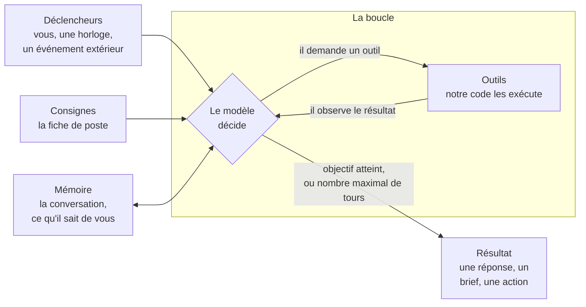
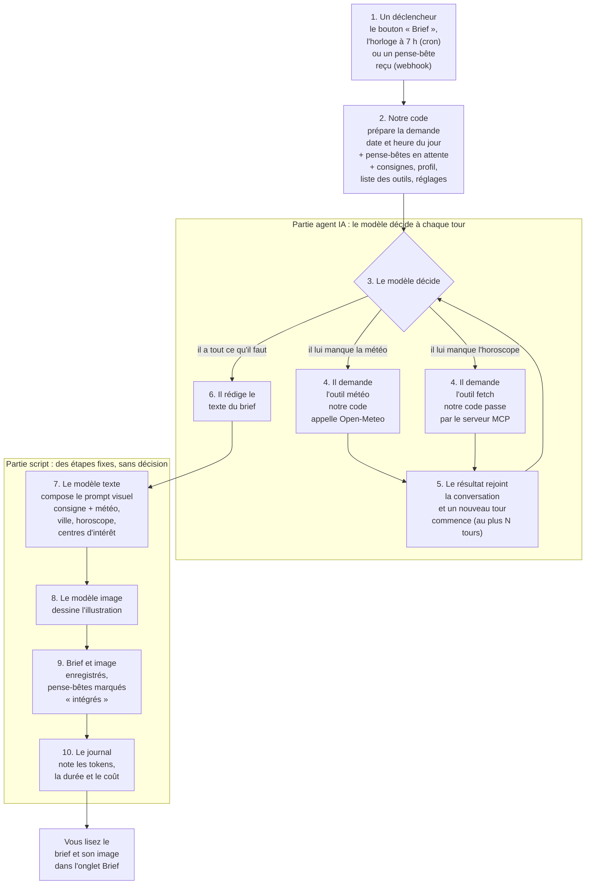
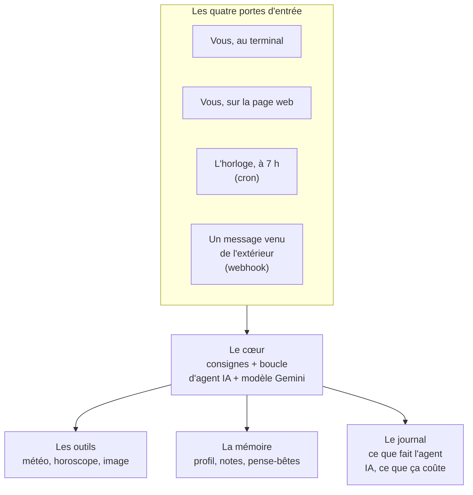
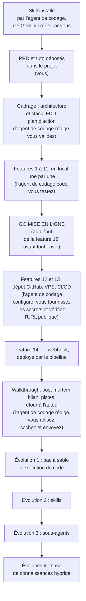

# Apprendre à créer et héberger des agents IA autonomes en Python

> **Ceci est un projet pédagogique.** Son but n'est pas de livrer une application, mais de vous apprendre à **concevoir, coder et mettre en production un agent IA autonome écrit en Python**, pas à pas, en vibe coding.
> Par **Le Cinquième Jour** · Version 1.0 · septembre 2026
>
> Conçu et validé pour **Antigravity IDE**. Il doit fonctionner aussi dans VS Code ou l'un de ses forks, sans que ce parcours ait été validé.

## 🎯 Un projet pour apprendre

À la fin de ce parcours, vous saurez :

- **créer** un agent IA autonome en Python : un programme qui raisonne avec un modèle d'IA, appelle des outils, garde une mémoire et démarre sans qu'on lui parle, déclenché par une horloge (cron) ou par un message venu de l'extérieur (webhook) ;
- **l'observer** : voir ce qu'il fait, ce qu'il sait et ce qu'il coûte ;
- **l'héberger** : le déployer sur votre propre serveur (VPS), en HTTPS, mis à jour automatiquement à chaque modification.

Pour apprendre tout cela sur du concret, vous construisez un agent IA complet : **GoodVibe**. Ce n'est qu'un prétexte, un fil rouge. Ce qui compte, ce sont les briques que vous apprenez à assembler, réutilisables pour n'importe quel autre agent IA.

### Ce qu'est un agent IA

**Un agent IA est un programme autonome : on lui confie un objectif et des outils, et un modèle d'IA décide seul, en boucle, des étapes pour l'atteindre.** À chaque tour, le modèle choisit l'action suivante : appeler un outil, ou répondre. Notre code exécute l'outil, le résultat revient au modèle, et il décide de la suite. La boucle s'arrête quand l'objectif est atteint, ou quand un garde-fou l'arrête.



Cinq ingrédients : un **modèle** (le cerveau), des **consignes** (sa fiche de poste), des **outils** (ses mains), une **boucle** (il observe le résultat et décide de la suite) et une **condition d'arrêt** (l'objectif atteint, ou un nombre maximal de tours).

**Ce qui permet son autonomie** :

- **les déclencheurs** : un agent IA ne démarre pas seulement quand on lui parle. Il peut partir d'une horloge (le *cron* : chaque matin à 7 h) ou d'un événement extérieur (le *webhook* : un message reçu). GoodVibe a quatre portes d'entrée : le terminal, la page web, l'horloge et un message venu de l'extérieur ;
- **la mémoire** : le modèle ne se souvient de rien d'un appel à l'autre. La mémoire est dans notre code. Il y a une mémoire de travail, la conversation en cours, renvoyée à chaque tour. Et il y a une mémoire durable : le profil et les notes, rangés dans une base et relus à chaque démarrage.

**Une autonomie bornée par vous** : les outils que vous lui donnez, ses consignes, son nombre maximal de tours, et les confirmations que le programme exige de vous avant une action irréversible, comme « Oublie-moi » : l'agent IA propose, c'est votre clic qui supprime.

### Pourquoi vibe coder son agent IA soi-même ?

Des plateformes permettent de créer un agent IA sans écrire de code, ou presque : outils sans code (Dust, n8n), kits des fournisseurs de modèles (Anthropic, OpenAI, Microsoft Azure AI Foundry, Google), frameworks d'agents IA (LangGraph, CrewAI). Elles sont souvent le bon choix pour aller vite. Ce tuto poursuit un autre but : **comprendre et maîtriser**.

En vibe codant GoodVibe vous-même :

- **vous voyez ce que cachent toutes les plateformes** : la boucle, les outils, la mémoire, les tokens. Vous comprendrez ensuite n'importe laquelle en une heure ;
- **vous voyez tout** : chaque appel, chaque token, chaque centime ;
- **vos données restent sur votre serveur**, et « Oublie-moi » efface ce que GoodVibe garde de vous : profil, notes, conversations, pense-bêtes, briefs et images ;
- **le coût reste de quelques euros par mois**, sans abonnement par utilisateur ;
- **le code est à vous**, et vous apprenez le métier de la production : cron, webhook, HTTPS, CI/CD ;
- **vous maîtrisez le vibe coding** : GoodVibe devient un point de départ, que vous adaptez et faites évoluer, avec votre agent de codage, vers la solution agentique dont **vous** avez besoin.

**Une plateforme, c'est un costume ou une robe de prêt-à-porter** : vite enfilé, mais coupé pour tout le monde. **Ce tuto vous apprend la couture sur mesure** : c'est plus long qu'un assemblage de blocs, et c'est voulu. Une fois le métier acquis, vous taillez le costume ou la robe qui vous va parfaitement, et vous le retouchez à l'infini, au fil de vos besoins. Ou vous choisissez votre prêt-à-porter en connaissance de cause.

*Exemples cités en octobre 2026 : les noms et les offres évoluent vite.*

### Un agent IA en action : le brief de GoodVibe

Le brief du matin de GoodVibe, de bout en bout : l'agent IA rédige le texte en choisissant ses outils, puis l'image suit des étapes fixes.



Si une source ne répond pas, le brief sort quand même, avec un message d'erreur à sa place. Le détail est en section 2.1 du tuto.

**GoodVibe, c'est cette boucle, avec quatre portes d'entrée et trois appuis :**



## 🧭 Le moteur du tuto : le skill VibeCoding Copilote

Ce tuto est l'application pratique du skill **[VibeCoding Copilote](https://github.com/lecinquiemejour-code/vibecoding-copilote)** (Le Cinquième Jour). **Il est indispensable : sans lui, le tuto ne fonctionne pas.**

| | Rôle |
|---|---|
| [**vibecoding-copilote**](https://github.com/lecinquiemejour-code/vibecoding-copilote) | **La méthode.** Un skill qui pilote votre agent de codage à partir d'un PRD : cadrage (architecture, découpage, plan d'action), puis construction feature par feature avec une **validation humaine à chaque étape** (les « GO »), jusqu'à la mise en ligne. Réutilisable pour n'importe quel projet. |
| **goodvibe-tuto** (ce dépôt) | **Le cas pratique.** Le PRD de GoodVibe et le tuto qui indique au skill, pour chaque feature, les options à proposer, les points à relire et les tests à faire. |

👉 Vous n'avez rien à télécharger à la main : **c'est l'agent de codage qui installe le skill** à l'étape 3 du démarrage rapide.

---

## C'est quoi GoodVibe ?

**GoodVibe** est un assistant personnel du matin. Il :

- apprend qui vous êtes en discutant avec vous (prénom, signe astrologique, ville, centres d'intérêt) ;
- prépare chaque matin à 7 h un **brief personnalisé** : horoscope réécrit pour vous, météo de votre ville, image du jour, pense-bêtes ;
- répond à vos questions dans la journée, depuis votre **terminal** ou une **page web privée**, conçue pour un écran d'ordinateur ;
- montre tout ce qu'il sait de vous et tout ce qu'il fait (outils appelés, tokens consommés, coût estimé).

Le sujet est volontairement léger. L'architecture, elle, est celle d'un vrai agent IA en production : remplacez horoscope et météo par veille concurrentielle et boîte mail, rien ne change.

## Ce que vous allez apprendre

| Brique | Dans GoodVibe |
|---|---|
| Boucle d'agent IA | Le chat en streaming, avec appels d'outils |
| Prompt système et réglages | La fiche de poste de GoodVibe, dans un fichier Markdown, et le tempérament du modèle : température, longueur de réponse, réflexion |
| Cron | Le brief généré chaque matin à 7 h sur le serveur, une seule fois par jour |
| Webhook | Un pense-bête envoyé depuis votre téléphone via un client HTTP en ligne (Hoppscotch), ou depuis votre terminal avec `curl`, protégé par un jeton secret ; il refait aussitôt le brief du jour, texte et image |
| Outil sur mesure | La météo, lue dans l'API Open-Meteo par un appel direct : la description de l'outil, la requête et la mise en forme sont écrites par nous |
| MCP | L'horoscope, lu dans une autre API par le serveur MCP officiel `fetch` : cette fois l'outil est apporté par le serveur, un petit programme que GoodVibe lance sur sa propre machine. Deux chemins vers deux API, à comparer |
| Pannes visibles | Quand une source ne répond pas, le brief sort avec un message d'erreur à sa place, qui dit ce qui a échoué et pourquoi. Aucun contenu de remplacement, rien d'inventé |
| Mémoire | Le profil, les notes et les conversations en SQLite, avec le retrait d'une note et « Oublie-moi ». Les conversations ne gardent que le dialogue : vos messages et le texte des réponses |
| Observabilité | Un journal d'activité : tokens, latence, coût en euros. Et les coulisses, en direct : la requête envoyée au modèle, sa réflexion, puis chaque appel d'outil avec ses JSON, dans le chat comme dans le brief, et un relevé des tokens sous chaque réponse. Et le flux brut : ce que le modèle envoie vraiment en streaming, événement par événement, dans un panneau à côté du chat et du brief. Coulisses, flux brut et relevé s'affichent à l'écran, sans être enregistrés ni renvoyés au modèle |
| CI/CD | Déploiement automatique par GitHub Actions à chaque push |
| Production | Un VPS Ubuntu, `systemd`, Caddy en HTTPS |

## Contenu de ce dépôt

Ce dépôt est le kit de départ. Il contient du code de référence, dans `templates/`, mais votre code, c'est votre agent de codage qui le produira avec vous, fiche par fiche.

| Fichier | Rôle |
|---|---|
| [`GoodVibe-PRD.md`](GoodVibe-PRD.md) | Le cahier des charges produit : **quoi** construire (fonctionnalités, contraintes, critères de succès). Fourni prêt à l'emploi. |
| [`tuto-goodvibe-vibecoding.md`](tuto-goodvibe-vibecoding.md) | Le tuto : **comment** le construire. Sert de référence à l'agent de codage : options de chaque étape, points à relire, tests à faire. |
| `README.md` | Ce fichier : la présentation du projet. Dans votre dossier de travail, l'agent de codage le renomme en `GoodVibe-presentation.md` et s'en sert pour vous présenter le projet avant de commencer. |
| [`templates/`](templates/) | Le code de référence de GoodVibe V1, validé en production. L'agent de codage le consulte au PLAN de chaque fiche et n'en reprend que ce que la fiche demande. Mode d'emploi : [`templates/README.md`](templates/README.md). |
| [`LICENSE.md`](LICENSE.md) | La licence en clair : gratuit pour un usage non commercial, payant pour un usage commercial. |
| [`LICENSES/`](LICENSES/) | Les textes officiels des deux licences. |

## Pour qui ?

Pour les **développeurs intermédiaires** qui découvrent les agents IA et le vibe coding. « Intermédiaire » signifie ici savoir **lire** le code généré pour le juger, pas forcément l'écrire.

Le principe : **vous êtes le pilote, l'agent de codage est votre copilote.** Le *pilote*, c'est la personne qui construit GoodVibe : il décide, valide et teste, et le mot revient tout au long du tuto. L'agent de codage écrit le code, installe les outils, lance les commandes et gère Git, en expliquant ce qu'il fait. Vous :

- créez les comptes en ligne et copiez les clés API ;
- relevez vous-même les prix des modèles sur la page des tarifs de Google : un prix que vous avez lu est un prix vérifié ;
- validez chaque étape (les « GO ») ;
- testez le résultat (le CHECK) : c'est vous qui jugez, jamais l'agent de codage.

## Prérequis

- **Antigravity IDE** installé, avec Gemini intégré. Ce tuto est conçu et validé pour Antigravity IDE. Il doit fonctionner aussi dans **VS Code** ou l'un de ses forks, avec Claude Code, Codex ou GitHub Copilot : le prompt de démarrage et les fichiers de règles sont prévus pour eux, mais ce parcours n'a pas été validé.
- Un compte **Google AI Studio**. La clé API Gemini se crée plus tard, à la fiche 1, avec la facturation activée sur son projet (carte bancaire nécessaire) : inutile de l'anticiper.
- Un compte **GitHub**.
- *Pour la mise en ligne uniquement (fin de parcours)* : un compte **Hetzner Cloud** (ou tout VPS Ubuntu accessible en SSH). Un nom de domaine est facultatif : le tuto utilise une adresse gratuite.
- *Recommandé* : l'extension **Claude Code** dans Antigravity, si vous avez un abonnement Claude. Elle prend le relais quand les quotas de l'agent de codage Gemini, celui d'Antigravity, sont atteints.

Pas besoin d'installer Python ni Git vous-même : **l'agent de codage les installe** s'ils manquent.

## Ce qui est gratuit, ce qui coûte

- **Gratuit** : Antigravity et son agent de codage Gemini (avec des quotas : c'est pour cela que Claude Code est recommandé en relais), Open-Meteo et l'API horoscope (sans clé), GitHub et son pipeline GitHub Actions (le quota gratuit suffit largement).
- **Payant à l'usage : les appels de GoodVibe à l'API Gemini**, avec la clé que vous créez à la fiche 1. Le modèle texte a un niveau gratuit, avec des quotas. Le modèle image de la fiche 10 n'en avait pas en septembre 2026 : la facturation est à activer chez Google dès la fiche 1, avec un plafond de dépense (une carte bancaire est donc nécessaire dès le départ). Comptez de l'ordre d'un à deux euros par mois pour un brief et une image par jour, dont l'essentiel pour les images. L'agent de codage vous donne le chiffre du jour quand il vous recommande un modèle, et l'onglet Activité affiche le coût estimé. Fixez un plafond de dépense chez Google.
- **Payant, à partir de la fiche 12** : le VPS, facturé à l'heure chez Hetzner, avec un plafond de quelques euros par mois. Attention : un serveur éteint reste facturé, il faut le supprimer pour arrêter les frais. Aucun nom de domaine à acheter : le tuto utilise une adresse gratuite. Jusque-là, tout tourne sur votre machine.
- **À surveiller** : la génération d'images (fiche 10). Si le plafond de dépense est atteint, le brief sort sans image, avec un message d'erreur qui le dit.

---

## 🚀 Démarrage rapide

### 1. Préparez un répertoire vierge

Créez un dossier vide (par exemple `goodvibe/`) et ouvrez-le avec **Antigravity IDE** (ou, à défaut, VS Code ou l'un de ses forks). Vous n'y mettrez qu'un seul fichier : le ZIP du kit.

### 2. Déposez le ZIP du kit dans le dossier

Sur la page d'accueil du dépôt, cliquez sur le bouton vert **`<> Code`** → **Download ZIP**. Déposez ce fichier ZIP tel quel dans votre dossier vierge, sans l'ouvrir : c'est l'agent de codage qui le décompressera. Il contient :

- `GoodVibe-PRD.md`
- `tuto-goodvibe-vibecoding.md`
- `README.md` : la présentation du projet, que l'agent de codage renommera en `GoodVibe-presentation.md`
- `LICENSE.md` et `LICENSES/` : la licence
- `templates/` : le code de référence, que l'agent de codage consulte fiche par fiche

> ⚠️ Rien d'autre : pas de venv, pas de Git, pas de skill. Ne clonez pas ce dépôt dans votre dossier de travail : l'agent de codage initialisera lui-même **votre** dépôt Git. Il s'occupe du reste.

> 💡 Les schémas du tuto sont en Mermaid : ils s'affichent sur GitHub, mais pas dans l'aperçu Markdown d'Antigravity sans extension. Installez **Markdown Preview Mermaid Support** : Ctrl + Maj + X, tapez `bierner.markdown-mermaid` (la marketplace d'Antigravity est Open VSX, la recherche en clair la classe mal), puis Ctrl + Maj + V pour l'aperçu. Ou lisez le tuto **sur GitHub**.

### 3. Collez ce prompt dans votre agent de codage

Collez-le tel quel : il n'y a rien à y compléter. L'agent de codage vous posera trois questions simples, le diagnostic d'entrée, pour régler le niveau de ses explications. Vos réponses changent la quantité d'explications, jamais ce que vous construisez.

```
Nous démarrons le projet GoodVibe dans ce répertoire vierge. Si une étape ci-dessous est déjà faite, dis-le-moi et passe à la suivante.

Étape 1, avant toute autre chose : décompresse le fichier .zip du kit présent dans ce dossier (celui qui contient GoodVibe-PRD.md), place son contenu à la racine : les trois fichiers (GoodVibe-PRD.md, tuto-goodvibe-vibecoding.md, README.md), le fichier LICENSE.md et les dossiers templates/ et LICENSES/, sans rien modifier dans templates/, puis supprime le .zip et le dossier vide issu de la décompression. Renomme README.md en GoodVibe-presentation.md (c'est la présentation du projet : tu t'en serviras pour la visite guidée, ne la modifie pas).

Étape 2 : installe le skill VibeCoding Copilote dans .agents/skills/vibecoding-copilote/, dans ce seul dossier. Télécharge le ZIP du dépôt https://github.com/lecinquiemejour-code/vibecoding-copilote et extrais-le là, sans dossier .git. Si un ZIP du skill est déjà présent à la racine du projet, extrais celui-là au lieu de télécharger, puis supprime-le. Vérifie que SKILL.md, references/ et assets/CLAUDE.md sont présents, et dis-moi ce que tu as installé, et où.

Étape 3 : lis le SKILL.md du skill et déroule-le fidèlement sur GoodVibe-PRD.md, en commençant par la Phase 0.

Contexte du projet :
- Le skill VibeCoding Copilote donne la méthode : suis-le (présentation, diagnostic d'entrée à la place de la question de calibrage, cadrage document par document, puis boucle PDCA feature par feature avec GO #1, CHECK par moi, GO #2), sauf sur les huit règles de la note d'en-tête du tuto, qui priment sur lui.
- Fichier de règles : quand le skill dépose son gabarit CLAUDE.md à la racine, ajoute-y les huit lignes de la section 3.4 du tuto, corrige les lignes du gabarit qu'elles contredisent, et montre-moi le fichier entier. Dépose-en une copie identique sous le nom AGENTS.md, et garde les deux fichiers identiques à chaque modification : selon l'agent, c'est l'un ou l'autre qui est lu.
- Document de reprise : tiens REPRISE.md à jour, comme l'indique la section 4.2 du tuto.
- Le fichier tuto-goodvibe-vibecoding.md est la référence du projet : lis-le tel qu'il est dans le dépôt, en fichier brut, jamais dans un aperçu Markdown. Sa note d'en-tête et ses huit règles sont dans un commentaire HTML (<!-- AGENT : ... -->), invisible à l'affichage : lis-les et applique-les. Avant tout document, présente-moi le projet : ce qu'on construit, ce qu'est un agent, ses capacités, la vue d'architecture. Explique chaque mot technique. Au PLAN, commence par la leçon (le problème, l'idée en langage courant, les mots nouveaux), puis dis-moi ce que tu vas faire, étape par étape, et pourquoi. Ne me propose pas trois options : présente-moi uniquement la solution du tuto, expliquée. Après le DO et avant le CHECK, montre-moi le schéma de séquence de la feature, puis les extraits de code qui comptent, et explique-les. N'affiche jamais un secret dans la discussion : ni clé, ni mot de passe, ni jeton. Au CHECK, fais une seule action à la fois et arrête-toi pour que je constate. Dis-moi toujours quand quelque chose échoue, et pourquoi. Les points « À relire » et le CHECK de chaque feature se conforment au tuto. Ne me dévoile pas les « pièges » avant mon verdict.
- Mise en ligne sur VPS via GitHub Actions, pas Netlify. Modèle de l'agent construit : Gemini via google-genai (API Interactions). Ne choisis aucun modèle au cadrage et n'en reprends aucun de mémoire : tu me recommanderas le modèle texte au PLAN de la fiche 1 et le modèle image au PLAN de la fiche 10, après recherche dans la documentation officielle de Google, comme l'indique la note d'en-tête du tuto.
- Tout ce que tu peux installer, tu l'installes toi-même (Python 3.12, Git, outils en ligne de commande, DB Browser). Tu exécutes toi-même toutes les commandes (venv, pip, git, lancement des serveurs) en expliquant ce que tu fais et pourquoi. Je ne fais que ce que tu ne peux pas faire : comptes, clés, validations, tests.
- Erreurs : dans le code que tu écris, aucune erreur n'est masquée : ni contenu de remplacement, ni valeur par défaut à la place d'une donnée manquante, ni erreur interceptée en silence. Quand quelque chose échoue, le programme l'affiche là où je regarde, en disant ce qui a échoué et pourquoi, et le journal le note.
- Diagnostic d'entrée : à la place de la question de calibrage du skill, pose-moi les trois questions de la règle 2 de la note d'en-tête du tuto, une à la fois. Inscris mes réponses et l'accompagnement qui en découle dans le fichier de règles du projet, et calibre toutes tes explications dessus. Le diagnostic change la quantité d'explications, jamais ce qui est construit.

Commence par l'étape 1.
```

> 💡 **Un autre agent de codage, ou un autre éditeur ?** Le tuto est validé avec l'agent de codage Gemini d'Antigravity. Le même prompt doit valoir pour les autres : il fait lire le `SKILL.md` à l'agent de codage, sans attendre que l'éditeur détecte le skill. Ensuite, chaque agent de codage retrouve le skill et les règles par ses propres moyens :
>
> | Agent de codage | Où il tourne | Comment il retrouve le skill | Le fichier de règles qu'il lit |
> |---|---|---|---|
> | Gemini | Antigravity | Il détecte `.agents/skills/` | `AGENTS.md` |
> | Codex | VS Code, terminal | Il détecte `.agents/skills/` | `AGENTS.md` |
> | GitHub Copilot | VS Code | Il détecte `.agents/skills/` | `AGENTS.md` |
> | Claude Code | VS Code, Antigravity, terminal | Son fichier de règles lui dit où est le skill et de le lire | `CLAUDE.md` |
>
> C'est pour cela que le prompt demande deux fichiers de règles identiques, `CLAUDE.md` et `AGENTS.md`, et un seul dossier pour le skill. Vous pouvez changer d'agent de codage en cours de projet : le prompt de reprise suffit.

### 4. Vérifiez que l'agent de codage suit le skill

L'agent de codage doit **se présenter**, résumer la méthode PDCA en une phrase et poser **la première des trois questions** du diagnostic d'entrée, une seule à la fois : savez-vous lire une fonction Python simple, à quoi sert un commit Git, et distinguer une application sur votre ordinateur d'une application hébergée sur un serveur. S'il écrit du code d'emblée ou saute la présentation, il ne suit pas le skill : passez à l'étape 5.

### 5. Si l'agent de codage ne suit pas le skill

1. Vérifiez que le dossier `.agents/skills/vibecoding-copilote/` existe dans votre projet et contient `SKILL.md`.
2. S'il manque, l'agent de codage n'a pas pu télécharger le skill. Faites-le vous-même : sur [la page du skill](https://github.com/lecinquiemejour-code/vibecoding-copilote), bouton vert **`<> Code`** → **Download ZIP**, puis déposez ce ZIP tel quel à la racine de votre projet, sans l'ouvrir.
3. Ouvrez une **nouvelle conversation** avec l'agent de codage : c'est cela, « redémarrer la session ». Il relit alors ses fichiers de règles et la liste des skills.
4. Recollez le prompt de l'étape 3, en entier. L'agent de codage constate ce qui est déjà fait et reprend à la bonne étape.

### 6. Avant la première feature : la ceinture

Pendant le cadrage, l'agent de codage écrit le fichier de règles du projet (`CLAUDE.md` et sa copie `AGENTS.md`). Avant de lancer la première feature, vérifiez qu'il le recharge **tout seul** : ouvrez une **nouvelle conversation** et collez cette question, et rien d'autre.

```text
Sans ouvrir aucun fichier, dis-moi quelles règles tu dois suivre dans ce projet, une ligne par règle, et dans quel fichier tu les as trouvées.
```

La ceinture est attachée si l'agent de codage :

- nomme le bon fichier : `AGENTS.md` pour Gemini dans Antigravity, Codex et GitHub Copilot ; `CLAUDE.md` pour Claude Code ;
- cite la **Règle 0** : jamais de code ni de publication sans votre GO ;
- cite les **huit lignes** propres à GoodVibe : la mise en ligne sur un VPS et non sur Netlify, le CHECK, le modèle Gemini choisi aux fiches 1 et 10, aucune donnée personnelle, le tuto comme référence, la pédagogie, les secrets, les erreurs jamais masquées ;
- donne **le résultat de votre diagnostic d'entrée** : vos trois réponses et l'accompagnement retenu.

S'il hésite, s'il invente, ou s'il va lire des fichiers pour répondre, il ne charge pas ses règles. Vérifiez que `AGENTS.md` existe à la racine du projet et qu'il est identique à `CLAUDE.md`, puis recommencez dans une nouvelle conversation. Ne lancez pas la première feature sans cette ceinture, et refaites ce contrôle chaque fois que vous changez d'agent de codage. Le détail est dans le tuto, section 4.3.

### Pour les sessions suivantes

**À la fin de chaque session**, dites à l'agent de codage : « on s'arrête là ». Il met à jour `REPRISE.md`, le document de reprise du projet : où vous en êtes, ce qui attend votre décision, et le prompt à coller la prochaine fois.

**Au début de la session suivante**, ouvrez une nouvelle conversation et collez le prompt qui figure à la fin de `REPRISE.md`. S'il n'existe pas encore, collez celui-ci :

```
Reprends le vibecoding sur GoodVibe. Ce projet est déjà en cours et suit la méthode VibeCoding PDCA. Avant de me répondre, lis le SKILL.md du skill VibeCoding Copilote (dossier .agents/skills/vibecoding-copilote/), en particulier sa section « Reprise de session », puis la note d'en-tête de tuto-goodvibe-vibecoding.md, REPRISE.md et plan-action.md. Dis-moi où nous en sommes et ce que tu proposes de faire ensuite, puis attends ma réponse. Ne modifie aucun fichier sans mon GO.
```

## Si ça coince

| Symptôme | Que faire |
|---|---|
| L'agent de codage écrit du code d'emblée, sans se présenter ni poser le diagnostic d'entrée | Il ne suit pas le skill : suivez l'étape 5 du démarrage rapide (dossier du skill, nouvelle conversation, prompt recollé). |
| L'agent de codage n'arrive pas à télécharger le skill | Téléchargez vous-même son ZIP et déposez-le à la racine du projet : étape 5 du démarrage rapide. |
| L'agent de codage code ou modifie des fichiers sans attendre votre GO | Rappelez-lui la **Règle 0** du fichier de règles (`CLAUDE.md` et sa copie `AGENTS.md`) : jamais de code sans GO. S'il récidive, ouvrez une nouvelle conversation : le fichier de règles est relu. Vérifiez que `AGENTS.md` existe : c'est lui que lisent l'agent de codage Gemini d'Antigravity, Codex et GitHub Copilot. |
| « Quota exceeded », l'agent de codage s'arrête : son quota gratuit, celui de Gemini dans Antigravity, est épuisé | Attendez le renouvellement, ou passez le relais à **Claude Code** avec le prompt de reprise. |
| « Quota exceeded » dans GoodVibe lui-même, au chat ou au brief : c'est le quota de votre clé API | Attendez le renouvellement, ou activez la facturation chez Google, avec un plafond de dépense. |
| Vous reprenez après plusieurs jours sans savoir où vous en êtes | Ouvrez `REPRISE.md` dans votre projet : il dit où vous vous êtes arrêté et ce qui attend votre décision. `plan-action.md` dit quelle feature est « fait » et laquelle est en cours. Puis collez le prompt de reprise. |
| Erreur 404 ou « model not found » à l'appel de Gemini | Google a retiré ou renommé le modèle. Demandez à l'agent de codage de vérifier la documentation officielle et de changer le nom dans `config.py`. |
| Un CHECK est KO et l'agent de codage n'arrive pas à réparer | Chaque fiche du tuto a une rubrique **Pièges** : donnez-la à lire à l'agent de codage, elle liste les causes classiques. |
| Sur GitHub, les schémas affichent « Unable to render rich display » | Ce n'est pas le tuto : une extension du navigateur empêche GitHub de dessiner les schémas. Ouvrez la page en navigation privée, ou désactivez les extensions une par une pour trouver la fautive. |

---

## Le parcours



**Après la V1, quatre évolutions**, chacune dans son propre cycle PDCA, du plus petit changement au plus grand. D'abord un outil de plus, le bac à sable d'exécution de code, sans toucher à l'architecture. Puis les skills, qui allègent le prompt système. Puis les sous-agents, qui changent l'architecture une fois l'agent IA unique stabilisé. Enfin la base de connaissances, la plus lourde. L'argumentation complète est dans le tuto, section 1.3.

Chaque feature suit la même boucle **PDCA** : l'agent de codage vous fait la leçon (le problème, l'idée, les mots nouveaux), puis présente son **PLAN** (ce qu'il va faire, et pourquoi) → vous donnez le **GO #1** → l'agent de codage **code**, puis vous montre et vous explique les extraits qui comptent → vous faites le **CHECK** → **GO #2** → commit.

Tout tourne **en local jusqu'à la feature 11 incluse** : vous avez un produit complet sur votre machine avant de dépenser un centime d'hébergement. Les deux déclencheurs autonomes, le cron et le webhook, n'arrivent qu'avec le serveur : c'est là qu'ils ont un sens.

**Les 14 fiches de la version 1** (détaillées dans le tuto, section 5) :

1. Squelette et chat terminal
2. Page web
3. Journal d'activité
4. Base et profil
5. Oublier, une note ou tout
6. Brief du matin
7. Météo
8. Horoscope via MCP
9. Onglets Mémoire et Activité
10. Image du jour
11. Tests automatisés
12. GO MISE EN LIGNE : dépôt GitHub privé, installation du VPS, cron du matin
13. CI/CD GitHub Actions
14. Webhook pense-bête, déployé par le pipeline

## Stack technique

Imposée par le PRD. C'est l'agent de codage qui l'installe.

- **Langage** : Python 3.12
- **IA** : SDK `google-genai` (API Interactions). Les modèles ne sont pas imposés : au moment où une feature en a besoin (fiche 1 pour le texte, fiche 10 pour l'image), l'agent de codage recherche dans la [documentation de Google](https://ai.google.dev/gemini-api/docs/models) ceux qui sont recommandés ce jour-là (le Gemini Flash stable le plus récent pour le texte, le modèle image stable le moins coûteux) et vous recommande un modèle, en l'expliquant. Vous validez, puis vous relevez vous-même ses prix sur la [page des tarifs](https://ai.google.dev/gemini-api/docs/pricing) : l'agent de codage n'en écrit aucun de mémoire.
- **Web** : FastAPI + uvicorn (webhook), Gradio (page web)
- **Données** : SQLite
- **Outils** : `httpx` (appels directs aux API), bibliothèque `mcp` (client MCP), serveur `mcp-server-fetch` lancé par `uvx` (serveur MCP), `logging`
- **Sources externes**, deux API sans clé : [Open-Meteo](https://open-meteo.com) (météo, appelée directement), [freehoroscopeapi.com](https://freehoroscopeapi.com) (horoscope, lu via le serveur MCP `fetch`)
- **Production** : VPS Ubuntu LTS, `systemd`, Caddy (HTTPS), GitHub Actions

## Règles d'or

- **Aucun secret dans le code** : les clés et mots de passe vont dans le fichier `.env`, qui n'est jamais commité.
- **Aucune donnée personnelle** dans les logs, les tests ou le dépôt Git. Utilisez un **profil fictif** pour la démo : le tuto prend Marc, né le 12 mars 1988, habitant Lyon, amateur de vélo. Reprenez-le tel quel.
- **C'est vous qui jugez** chaque étape. Ne donnez jamais un GO sans avoir testé.

## Liens

- Skill **VibeCoding Copilote** : https://github.com/lecinquiemejour-code/vibecoding-copilote
- Le tuto complet : [`tuto-goodvibe-vibecoding.md`](tuto-goodvibe-vibecoding.md)
- Le PRD : [`GoodVibe-PRD.md`](GoodVibe-PRD.md)

## Licence

Libre pour un usage non commercial : le texte est sous CC BY-NC-SA 4.0, le code sous PolyForm Noncommercial 1.0.0. L'usage commercial (formation payante, revente, projet client) demande une licence payante. Le détail, avec des exemples, est dans [`LICENSE.md`](LICENSE.md).

---

*Un tuto **Le Cinquième Jour**.*
